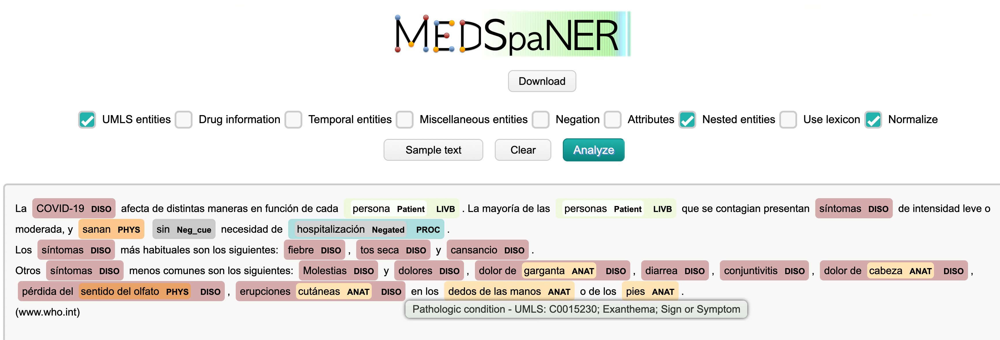
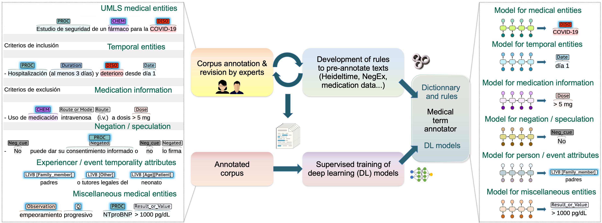

## Medical Semantic Python-Assisted Named Entity Recognizer

This is a hybrid (neural-network-based, lexicon-based and rule-based) sequence labeling tool for Spanish medical texts. It was originally developed for clinical trial texts, but it can be applied to other medical text genres.

The tool can annotate the following type of information:
- medical entities of 7 [Unified Medical Language System (UMLS)](https://www.nlm.nih.gov/research/umls/index.html) semantic groups (ANAT, CHEM, DEVI, DISO, LIVB, PHYS, PROC)
- temporal entities using the TimeML scheme: Date, Duration, Frequency (also known as *set*) and Time; Age is also added to the scheme
- negation and uncertainty/speculation
- medication information: Contraindication, Dosage or Strength, Route and Form
- miscellaneous medical entities: Concept, Observation\_or\_Finding, Food\_or\_Drink, Quantifier\_or\_Qualifier and Result\_or\_Value
- experiencer (Patient, Family\_member, Other) and event temporality attributes (History_of, Future)

MEDSPANER supports medical concept normalization (*entity linking*) to standard resources such as the [Unified Medical Language System (UMLS)](https://www.nlm.nih.gov/research/umls/index.html) and the [Systematized Nomenclature of Medicine – Clinical Terms](https://www.snomed.org/). 
Note that the normalization feature is still under development and any processing will require professional validation by coding experts.

:star: **Update (November 2024)** MEDSPANER has been enhanced to support normalization to the OHDSI Vocabulary codes used in the [OMOP Common Data Model](https://www.ohdsi.org/data-standardization/).


## Development workflow and system scheme

The figure below explains how the tool was developed.





The lexicon is [MedLexSp](https://github.com/lcampillos/MedLexSp), a computational vocabulary with lemmas and variant forms mapped to UMLS CUIs. It can be obtained via an usage license at: [https://digital.csic.es/handle/10261/270429](https://digital.csic.es/handle/10261/270429)

Rules were developed iteratively during the annotation of the [CT-EBM-SP corpus vs 2](https://zenodo.org/records/13880599). Standard algorithms were implemented, such as [NegEx](https://github.com/PlanTL-GOB-ES/NegEx-MES), [ConText](https://claritynlp.readthedocs.io/en/stable/developer_guide/algorithms/context.html) and [HeidelTime](https://github.com/HeidelTime/heideltime) adapted to the [Spanish language](https://github.com/PlanTL-GOB-ES/EHR-TTS).

The [guideline]([https://github.com/lcampillos/ct-ebm-sp-v2](https://github.com/lcampillos/ct-ebm-sp-v2/blob/main/annot_guideline_2024.pdf)) with the criteria for annotating the [CT-EBM-SP corpus vs 2](https://zenodo.org/records/13880599) is [available in this repository](https://github.com/lcampillos/ct-ebm-sp-v2/blob/main/annot_guideline_2024.pdf).

The neural model is [RoBERTA model trained on clinical and EHR data](https://huggingface.co/PlanTL-GOB-ES/bsc-bio-ehr-es), trained by the Barcelona Supercomputing Center, and fine-tuned in clinical trials annotated for different tasks: medical named entity recognition, temporal annotation, annotation of medication drug attributes, and annotation of negation and uncertainty/speculation.

All trained models for the MEDSPANER tool are available at the [Hugging Face hub](https://huggingface.co/medspaner): [https://huggingface.co/medspaner](https://huggingface.co/medspaner).


Installation and requirements
-------------------------

Install it by cloning the repository in local folder; run in a terminal: ```git clone https://github.com/lcampillos/medspaner```

Requirements:

* [Flaskr](https://flask.palletsprojects.com/en/2.2.x/) (tested with vs. 1.1.2): to use the graphical user interface.\
Install it by running in a terminal: ```pip install Flask```
* [GIT LFS](https://git-lfs.github.com/) (tested with vs. 3.1.2): to download large storage files, e.g. transformers models.\
Install it by running in a terminal: ```sudo apt-get install git-lfs```
* [python](https://www.python.org/downloads/) (tested with vs. 3.7)
* [spacy](https://spacy.io/) (tested with vs. 3.3.1)\
Install it by running in a terminal: ```pip install "spacy~=3.3.1"```\
Then, download the Spanish part-of-speech tagging model: ```python -m spacy download es_core_news_md```
* [textsearch](https://github.com/kootenpv/textsearch)\
Install it by running: ```pip install textsearch```
* [torch](https://pypi.org/project/torch/) (tested with vs. 1.10.2)\
Install it by running: ```pip install torch```
* [Transformers](https://huggingface.co/docs/transformers/installation) library by HuggingFace (tested with vs. 4.17)\
Install it by running: ```pip install transformers```

You can install the packages (except GIT LFS) by using the ```requirements.txt``` file and running the following command: ```pip install -r requirements.txt```


Usage
-------------------------

Download the pre-trained models from the [HuggingFace hub](https://huggingface.co/medspaner).

Make sure you have ```git-lfs``` installed before downloading the models (```git-lfs``` is needed to download large files):\
- In Mac OS:
Download git-lfs from: [https://git-lfs.github.com/](https://git-lfs.github.com/)
Unzip the file, get into the folder and then install it:
```sudo ./install.sh```
You then will see this message: ```Git LFS initialized.```
- In Linux (e.g. Ubuntu): ```sudo apt install git-lfs```

To clone the models into the ```models``` folder:\
```cd medspaner/```\
```cd code/```\
```cd models/```\
```git clone https://huggingface.co/medspaner/roberta-es-clinical-trials-umls-7sgs-ner```\
```git clone https://huggingface.co/medspaner/roberta-es-clinical-trials-temporal-ner```\
```git clone https://huggingface.co/medspaner/roberta-es-clinical-trials-medic-attr-ner```\
```git clone https://huggingface.co/medspaner/roberta-es-clinical-trials-neg-spec-ner```\
```git clone https://huggingface.co/medspaner/roberta-es-clinical-trials-misc-ents-ner```\
```git clone https://huggingface.co/medspaner/roberta-es-clinical-trials-attributes-ner```


#### Simple annotation using the [Transformers](https://huggingface.co/docs/transformers/installation) library

Import the token classification class:

    from transformers import AutoModelForTokenClassification

Then load the specific model. For example, use the following instruction to load the NER model for the UMLS semantic groups:

    model = "roberta-es-clinical-trials-umls-7sgs-ner"


#### Annotation using the integrated python code

The code provides transformer-based named entity recognition as well as functionalities for lexicon-based annotation, nested entities recognition, and normalization.

To annotate a single text, run with:

    python medspaner.py -conf config.conf -input PATH/TO/FILE.txt

To annotate a directory, run with:

    python medspaner_dir.py -conf config.conf -input PATH/TO/DIR


#### Demonstration tool (Graphical User Interface)

Go to the ```gui``` subfolder and run:

    python flaskr/gui_en.py

The GUI will be running in a local address, e.g. ```http://127.0.0.1:5000/gui_en```


Data format
-------------------------

The input data is a standard text file (```.txt```).

The output data format can be a BRAT (```.ann```) file or ```json```.


Lexicon
-------------------------

Please, contact to get a license to use the Spanish medical lexicon. The usage is free for educational and research purposes.

If you do not have a license, the ```pickle``` files (located at the ```lexicon``` subfolder) may throw an error.


List of patterns and annotation exceptions
-------------------------------------------------

You can optionally use a list of two-word patterns or single words to be re-labeled or excluded from the annotation.

This list would typically contain *noisy* entities or ambiguous words for a given task.

For example, to exclude all entities from the ```DEVI``` semantic group (medical devices), include the following line:

    ANY-LEMMA/DEVI|O

To re-label *edad* tagged as ```PHYS``` to ```O``` (no label), write:

    edad/PHYS|O

For two-word patterns, note that the current version only supports re-labelling the second token. For example, to re-label *iv* from ```Route``` to ```O```, write:

    estadio/O iv/Route|O


Configuration
-------------------------

Edit the fields in the configuration file (config.conf) to adapt it to your purposes:

* **att** - Select ```True``` to annotate entity attributes (experiencer and event temporality); select ```False``` otherwise
* **conf** - Use configuration file to parse arguments; select ```False``` if no file is used
* **drg** - Select ```True``` to annotate drug features such as Dosage Form, Dose or Strength, or Route; select ```False``` otherwise
* **exc** - Use a list of exceptions of entity types not to be annotated, or word patterns to re-label; indicate ```False``` if no patterns are applied
* **input** - Specify path to file or folder to annotate
* **lex** - Use lexicon for the annotation of UMLS entities; by default, the lexicon is located at: ```lexicon/MedLexSp.pickle```; indicate ```False``` if no lexicon is needed
* **misc** - Select ```True``` to annotate miscellaneous medical entities (observation/finding, food/drink, quantifier/qualifier and result/value); select ```False``` otherwise
* **neg** - Select ```True``` to annotate entities expressing negation and uncertainty; select ```False``` otherwise
* **nest** - Select ```True``` to output inner or nested entities inside wider entities (e.g. *pecho* in *cáncer de pecho*); select ```False``` to output only the entities with the wider scope (*flat entities*)
* **neu** - Select ```True``` (default value) to annotate UMLS entities with the trained neural model; select ```False``` otherwise
* **norm** - Indicate ```UMLS``` if the output needs to be normalized to UMLS CUIs; ```SNOMED```, to normalize to SNOMED CT; and ```OMOP```, to map to ODHSI vocabularies of the OMOP Common Data Model.
* **out** - Indicate ```ann``` ([BRAT](https://brat.nlplab.org/) format) or ```json``` (standard JSON data format)
* **temp** - Select ```True``` to annotate temporal expressions according to the HeidelTime scheme (Date, Duration, Frequency, Time) and Age; select ```False``` otherwise


References
-------------------------

<!------>

The annotation tool is described here:

[**Hybrid natural language processing tool for semantic annotation of medical texts in Spanish**](https://bmcbioinformatics.biomedcentral.com/articles/10.1186/s12859-024-05949-6)  
Leonardo Campillos-Llanos, Ana Valverde-Mateos, Adrián Capllonch-Carrión  
*BMC Bioinformatics* 26(7) (2025)

If you use this tool, please, cite as follows:

```
@article{2025medspaner,
  title={{Hybrid natural language processing tool for semantic annotation of medical texts in Spanish}},
  author={Campillos-Llanos, Leonardo and Valverde-Mateos, Ana and Capllonch-Carri{\'o}n, Adri{\'a}n},
  title={BMC Bioinformatics},
  year={2025},
  volume={26},
  number={7},
  pages={1--40},
  doi={https://doi.org/10.1186/s12859-024-05949-6},
  publisher={Springer (BioMed Central)}
}
```

The Medical Lexicon for Spanish (MedLexSp) is described here:

[**MedLexSp – A Medical Lexicon for Spanish Medical Natural Language Processing**](https://jbiomedsem.biomedcentral.com/articles/10.1186/s13326-022-00281-5)  
Leonardo Campillos-Llanos  
*Journal of Biomedical Semantics* (2024), 23

[**First Steps towards Building a Medical Lexicon for Spanish with Linguistic and Semantic Information**](https://aclanthology.org/W19-5017/)  
Leonardo Campillos-Llanos.
*Proc. of BioNLP 2019*, August 1st, 2019, Florence, Italy, pp. 152–164

The Clinical Trials for Evidence-based Medicine in Spanish (CT-EBM-SP) corpus is explained in this article:

[**A clinical trials corpus annotated with UMLS entities to enhance the access to evidence-based medicine**](https://bmcmedinformdecismak.biomedcentral.com/articles/10.1186/s12911-021-01395-z)  
Leonardo Campillos-Llanos, Ana Valverde-Mateos, Adrián Capllonch-Carrión and Antonio Moreno-Sandoval
*BMC Med Inform Decis Mak* (2021) 21:69


Intended uses & limitations
---------------------------

This tool is under development and needs to be improved. It should not be used for medical decision making without human assistance and supervision. It is intended for a generalist purpose, and may have bias and/or any other undesirable distortions.

Third parties who deploy or provide systems and/or services using any of these tools (or using systems based on these models) should note that it is their responsibility to mitigate the risks arising from their use. Third parties, in any event, need to comply with applicable regulations, including regulations concerning the use of artificial intelligence.

The owner or creator of the annotation system will in no event be liable for any results arising from the use made by third parties of these models.


License
---------------------------

The code is distributed under the General Public License 3 (AGPL-3.0) by default.
If you wish to use it under a different license, feel free to get in touch.

Copyright (c) 2019-2024 Leonardo Campillos-Llanos, CSIC (Spanish National Research Council)

```leonardo.campillos AT csic.es```

This program is free software: you can redistribute it and/or modify it under the terms of the GNU General Public License as published by the Free Software Foundation, either version 3 of the License, or (at your option) any later version.

This program is distributed in the hope that it will be useful, but WITHOUT ANY WARRANTY; without even the implied warranty of MERCHANTABILITY or FITNESS FOR A PARTICULAR PURPOSE. See the GNU Affero General Public License for more details.


Funding
---------------------------

This tool was developed in the NLPMedTerm project, funded by InterTalentum UAM, Marie Skłodowska-Curie COFUND grant (2019-2021) (H2020 program, contract number 713366), and in the CLARA-MeD project (reference: PID2020-116001RA-C33), funded by MCIN/AEI/10.13039/501100011033/, in project call: "Proyectos I+D+i Retos Investigación".

